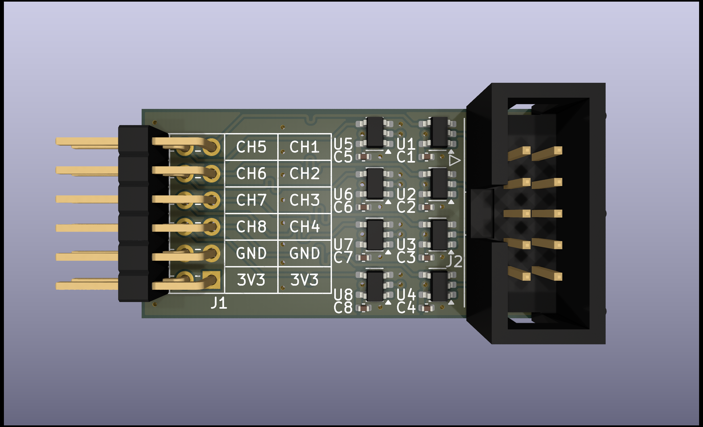

# logic-pmod

## Description

Logic level shifter with Digilent Pmod™ interface for use as logic analyzer.

- 8 fixed direction, length tuned, level shifting channels
- Up/down translation from 1.8V, 2.5V, 5V to 3.3V
- Bus Pirate probe cable compatible 10-pin connector

## Contents

| File                                           | Description             |
|------------------------------------------------|-------------------------|
| [logic-pmod.pdf](./logic-pmod.pdf)             | Schematic in PDF format |
| [logic-pmod.csv](./logic-pmod.csv)             | BOM in CSV format       |
| [logic-pmod.png](./logic-pmod.png)             | PCB 3D render           |
|                                                |                         |
| [logic-pmod.kicad_pro](./logic-pmod.kicad_pro) | KiCad 8.0.0 project     |
| [logic-pmod.kicad_pcb](./logic-pmod.kicad_pcb) | KiCad 8.0.0 PCB         |
| [logic-pmod.kicad_sch](./logic-pmod.kicad_sch) | KiCad 8.0.0 schematic   |

## Probe Pinout

| Pin | Color  | Net  |
|-----|--------|------|
|   1 | Brown  | GND  |
|   2 | Red    | +3V3 |
|     |        |      |
|   3 | Orange | CH5  |
|   4 | Yellow | CH1  |
|   5 | Green  | CH6  |
|   6 | Blue   | CH2  |
|   7 | Purple | CH7  |
|   8 | Grey   | CH3  |
|   9 | White  | CH8  |
|  10 | Black  | CH4  |

## Further Reading

- FPGA Logic Analyzer and GUI [^1]
- Small footprint and configurable embedded FPGA logic analyzer [^2]
- Integrated Logic Analyzer (ILA) [^3]

[^1]: https://github.com/lekgolo167/enxor-logic-analyzer
[^2]: https://github.com/enjoy-digital/litescope
[^3]: https://www.xilinx.com/products/intellectual-property/ila.html
